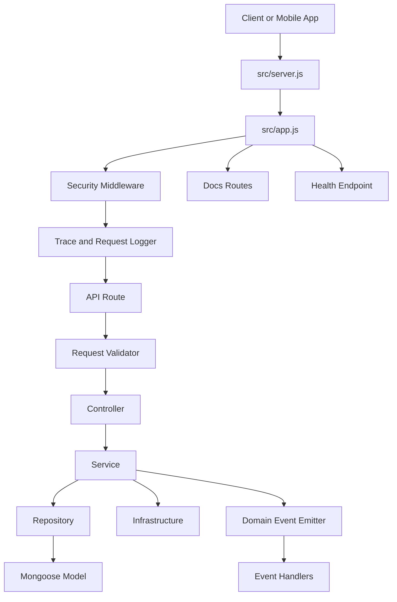
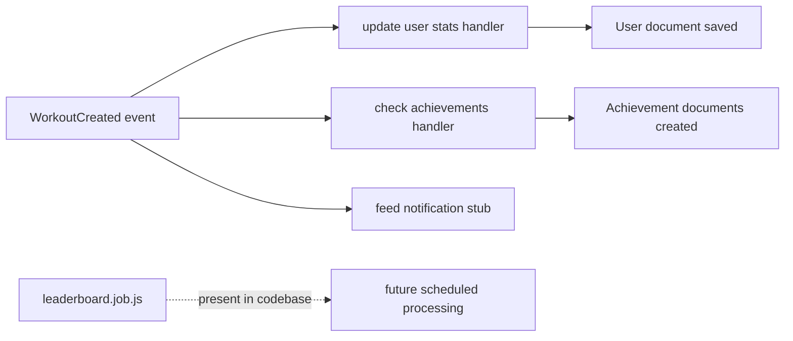

# Backend Architecture

## Overview

Trainly uses a layered Node.js + Express backend centered on `backend/src`.

The active runtime path is:

1. `backend/src/server.js`
2. `backend/src/app.js`
3. `backend/src/api/routes/*`
4. `backend/src/api/controllers/*`
5. `backend/src/services/*`
6. `backend/src/repositories/*`
7. `backend/models/*`

## Runtime Bootstrap

`backend/src/server.js` is the canonical entrypoint.

It is responsible for:

- loading environment variables through `dotenv`
- connecting to MongoDB with Mongoose
- registering domain event handlers once
- starting the Express listener
- graceful shutdown for MongoDB and Redis

## Express Composition

`backend/src/app.js` composes the HTTP stack in this order:

1. security middleware
2. request body parsing
3. trace middleware
4. request logging
5. static uploads serving
6. docs routes
7. API routes
8. health endpoint
9. not-found middleware
10. centralized error middleware

## Layers

### API Layer

Location:

- `backend/src/api/routes`
- `backend/src/api/controllers`
- `backend/src/api/validators`

Responsibilities:

- route registration
- request validation
- auth guards
- response shaping

### Service Layer

Location:

- `backend/src/services`

Responsibilities:

- business rules
- orchestration across repositories and infrastructure
- logging side effects
- domain event emission

Examples:

- `auth.service.js`
- `workout.service.js`
- `post.service.js`
- `sos.service.js`

### Repository Layer

Location:

- `backend/src/repositories`

Responsibilities:

- persistence access
- MongoDB query composition
- Mongoose document retrieval and updates

### Model Layer

Location:

- `backend/models`

Current status:

- root-level models remain the active Mongoose schema source
- `src` routes and services now call them through repositories where possible

## Middleware Conventions

### Validation

All actively standardized routes use:

- `validateRequest(...)` from `backend/src/api/validators/shared.js`

Validated values are stored under:

- `req.validated.body`
- `req.validated.query`
- `req.validated.params`

### Errors

All async controller handlers use:

- `backend/src/middleware/asyncHandler.js`

Structured application errors are defined in:

- `backend/src/core/errors/AppError.js`

Centralized formatting happens in:

- `backend/src/middleware/errorHandler.js`

### Logging

Logging uses `pino` via:

- `backend/src/core/logger/index.js`

Request-level logging uses:

- `backend/src/middleware/requestLogger.js`

Trace context is provided by:

- `backend/src/core/tracing/index.js`

## Security and Operations

Security middleware is configured in:

- `backend/src/middleware/security.js`

Current protections:

- `helmet`
- CORS using `CORS_ORIGIN`
- global rate limiting
- SOS-specific rate limiting

## Event-Driven Behavior

When a workout is created, `workout.service.js` emits `WorkoutCreated`.

Registered handlers in `backend/src/events/handlers/workoutHandlers.js` currently:

- update user stats using `user.updateWorkoutStats(...)`
- check and create achievements
- log a feed notification stub in non-test environments

## High-Level Diagram

## Event / Job Diagram

