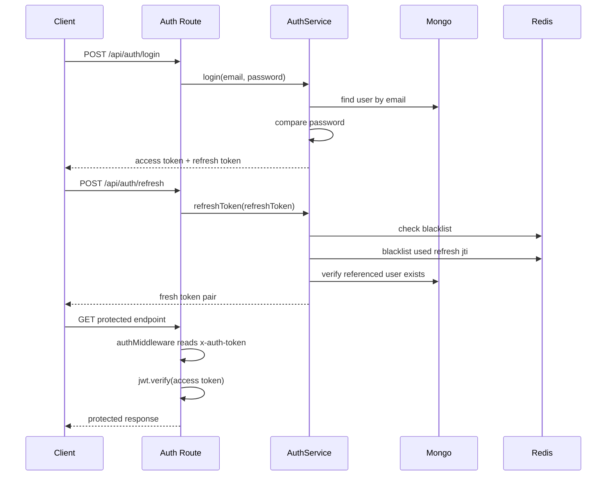

# Auth Flow

## Overview

Trainly uses JWT-based auth with:

- short-lived access token
- longer-lived refresh token
- optional Redis-backed token blacklist behavior

Core code:

- `backend/src/services/auth.service.js`
- `backend/src/middleware/auth.js`
- `backend/src/infrastructure/cache/index.js`

## Register

Route:

- `POST /api/auth/register`

Flow:

1. request body is validated
2. `auth.service.register(...)` checks for an existing user by email
3. a new `User` document is created
4. the model hashes the password in a pre-save hook
5. access and refresh tokens are generated
6. user summary plus tokens are returned

## Login

Route:

- `POST /api/auth/login`

Flow:

1. request body is validated
2. the user is looked up by email
3. `bcrypt.compare(...)` verifies the submitted password
4. token pair is generated
5. response returns user summary, access token, and refresh token

## Access Token

Current format:

- signed with `JWT_SECRET`
- payload includes `user.id`
- expires in `1d`

The active auth middleware reads the token from:

- `x-auth-token`

It does not currently read a bearer token from the `Authorization` header.

## Refresh Token

Current format:

- signed with `REFRESH_TOKEN_SECRET` if set, otherwise `JWT_SECRET`
- includes `user.id`
- includes a `jti`
- expires in `30d`

Refresh route:

- `POST /api/auth/refresh`

Behavior:

- verifies the refresh token
- checks whether the token JTI is blacklisted in Redis
- blacklists the used refresh token JTI
- issues a fresh token pair

## Logout

Route:

- `POST /api/auth/logout`

Behavior:

- if `tokenJti` is provided, it is blacklisted in Redis
- this supports explicit token revocation

## Redis Interaction

Auth uses the cache layer for blacklist behavior.

When Redis is not configured:

- cache methods degrade safely
- blacklist checks effectively become no-ops

That means auth still works without Redis, but refresh-token revocation is weaker.

## JWT Lifecycle Diagram

## Operational Notes

- `JWT_SECRET` and `MONGODB_URI` are required
- `REFRESH_TOKEN_SECRET` is optional but recommended
- Redis is optional but improves revocation behavior
