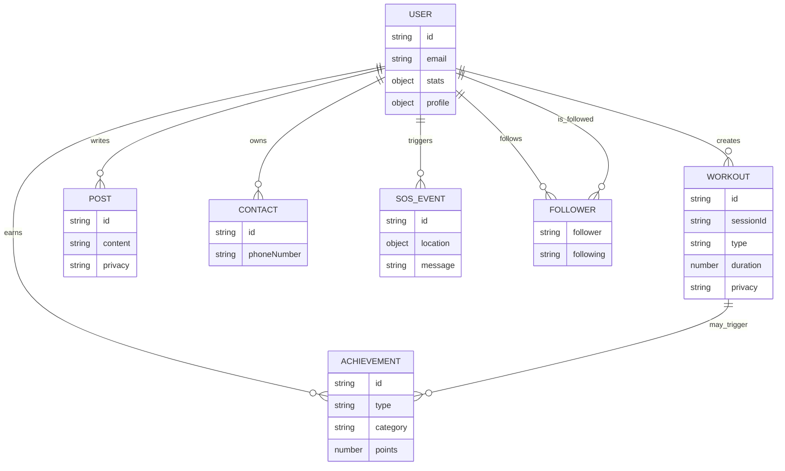

# Data Model

## Overview

The current backend persists data through Mongoose models stored in `backend/models`.

Primary entities:

- User
- Workout
- Post
- Achievement
- Contact
- Follower
- SosEvent

## User

Source:

- `backend/models/user.js`

Key fields:

- `name`
- `email`
- `password`
- `avatar`
- `stats`
- `preferences`
- `profile`
- `createdAt`
- `updatedAt`

Important behavior:

- passwords are hashed in a pre-save hook
- `updateWorkoutStats(...)` mutates aggregate stats when a workout is created
- streaks and activity-specific stats are calculated on the document

## Workout

Source:

- `backend/models/workout.js`

Core fields:

- `userId`
- `sessionId`
- `type`
- `name`
- `startTime`
- `endTime`
- `duration`
- `calories`
- `notes`
- `privacy`
- `likes`
- `comments`

Activity-specific embedded structures exist for:

- running
- cycling
- swimming
- gym

Notable features:

- route GPS points for running and cycling
- likes/comments embedded on the workout document
- `sessionId` must be unique

## Post

Source:

- `backend/models/post.js`

Fields:

- `user`
- `content`
- `image`
- `privacy`
- `workoutDetails`
- `likes`
- `comments`
- `createdAt`

Posts are used for the social feed and can reference workout summary data, but they do not directly reference a workout document in the current schema.

## Achievement

Source:

- `backend/models/Achievement.js`

Fields:

- `user`
- `title`
- `emoji`
- `type`
- `category`
- `description`
- `progress`
- `rarity`
- `points`
- `workoutId`
- `workoutType`
- `isUnlocked`
- `isVisible`
- `isShared`
- `sharedAt`

Important behavior:

- includes static achievement templates via `getAchievementTemplates()`
- indexed by user, category/rarity, and type

## Contact

Source:

- `backend/models/contact.js`

Fields:

- `name`
- `phoneNumber`
- `userId`
- `createdAt`

Notes:

- phone validation uses `google-libphonenumber`
- `phoneNumber` is globally unique in the current schema, not just unique per user

## Follower

Source:

- `backend/models/Follower.js`

Fields:

- `follower`
- `following`
- `createdAt`

Constraint:

- unique compound index on `(follower, following)`

## SosEvent

Source:

- `backend/models/sosEvent.js`

Fields:

- `userId`
- `location`
- `message`
- `contacts`
- `results`
- `createdAt`

Purpose:

- audit trail for SOS sends

## Relationships

## Repository Mapping

Repositories currently wrap these models:

- `users/user.repository.js` -> `User`
- `workouts/workout.repository.js` -> `Workout`
- `posts/post.repository.js` -> `Post`
- `achievements/achievement.repository.js` -> `Achievement`
- `contacts/contact.repository.js` -> `Contact`
- `follows/follow.repository.js` -> `Follower`
- `sos-events/sos-event.repository.js` -> `SosEvent`
