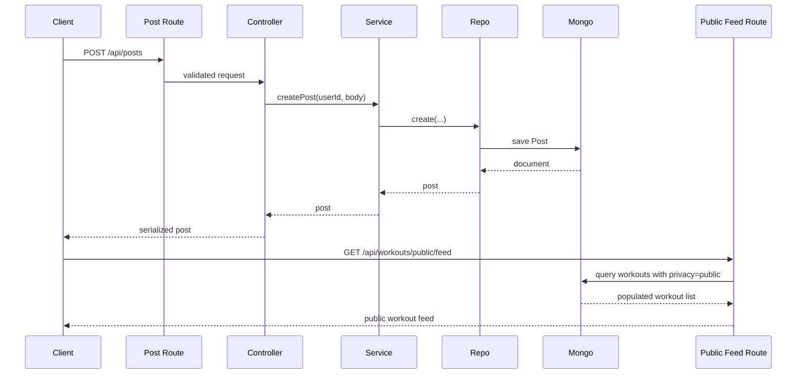

# Social Flow

## Overview

The social layer currently covers:

- posts
- comments
- likes
- follow relationships
- follower/following lookups
- public workout feed

Key code:

- `backend/src/api/routes/post.routes.js`
- `backend/src/api/routes/follow.routes.js`
- `backend/src/services/post.service.js`
- `backend/src/services/follow.service.js`

## Posts

Routes:

- `GET /api/posts`
- `POST /api/posts`
- `PUT /api/posts/:id/like`
- `POST /api/posts/:id/comments`
- `GET /api/posts/:id/comments`

Flow:

1. route validation normalizes params/query/body
2. controller delegates to `post.service.js`
3. service talks to `post.repository.js`
4. controller serializes the response shape for clients

Post documents support:

- free-text content
- optional image URL
- privacy flag
- optional embedded workout summary details
- likes
- embedded comments

## Follows

Routes:

- `POST /api/follow/:userId`
- `DELETE /api/follow/:userId`
- `GET /api/follow/followers`
- `GET /api/follow/following`

Flow:

1. authenticated user is resolved
2. follow service prevents self-follow
3. target user existence is checked
4. follow repository creates or deletes the relationship

The `Follower` model enforces uniqueness on `(follower, following)`.

## User-Centric Social Views

The `users` surface also exposes:

- `GET /api/users/followers`
- `GET /api/users/following`
- `POST /api/users/follow/:userId`
- `DELETE /api/users/follow/:userId`

These endpoints call the same follow service behavior through the user controller.

## Public Workout Feed

Route:

- `GET /api/workouts/public/feed`

This is part of the social experience because it exposes public workouts from all users rather than just the owner.

## Social Post and Feed Diagram

## Current Boundaries

- no dedicated feed ranking engine is active
- no notification delivery flow is active for likes/comments/follows
- the event handler feed hook is currently a stub
