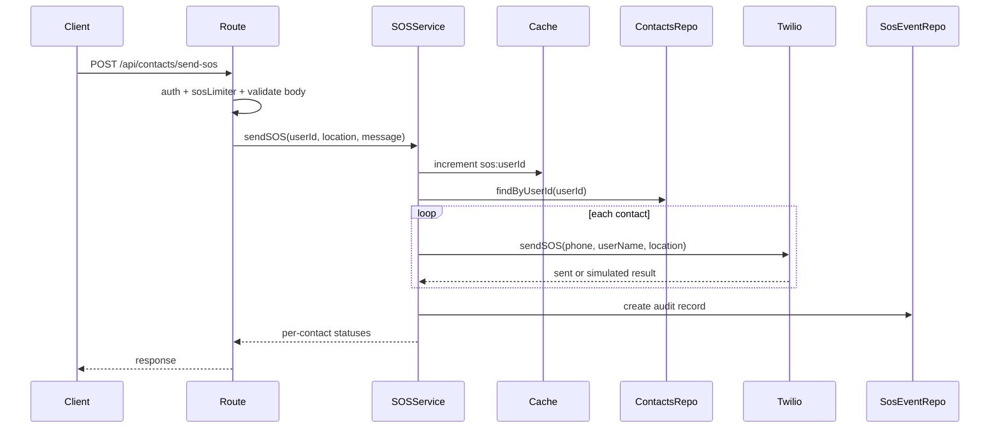

# SOS Flow

## Overview

SOS support lets an authenticated user send an emergency alert to saved contacts.

Key files:

- `backend/src/api/routes/contact.routes.js`
- `backend/src/api/controllers/sos.controller.js`
- `backend/src/services/sos.service.js`
- `backend/src/infrastructure/messaging/twilio.js`
- `backend/src/repositories/sos-events/sos-event.repository.js`

## Entry Route

Route:

- `POST /api/contacts/send-sos`

Protection:

- authenticated with `x-auth-token`
- SOS-specific rate limiting via `sosLimiter`
- request body validation through `sosBodySchema`

## Flow

1. controller receives validated `location` and optional `message`
2. service increments an SOS counter in Redis-like cache
3. service rejects the request if the hourly count exceeds `SOS_RATE_LIMIT_MAX`
4. service loads the user
5. service loads the user's emergency contacts
6. service calls Twilio messaging for each contact
7. service records an SOS event
8. result payload returns per-contact delivery status

## Twilio Behavior

If Twilio credentials are configured:

- SMS is actually sent using the Twilio SDK

If Twilio is not configured:

- the messaging adapter logs a warning
- `sendSMS` returns `{ status: 'simulated' }`

This allows local and test-like environments to exercise the flow without live SMS delivery.

## Persistence

SOS sends are recorded in `SosEvent` with:

- user id
- location
- message
- contact phone numbers
- per-contact results
- timestamp

## Redis / Cache Behavior

The service uses the cache layer to count SOS requests per user.

If Redis is absent:

- the cache layer safely degrades
- the increment result falls back to `0`
- the service still runs, but external rate enforcement becomes weaker

## SOS / Emergency Diagram

## Operational Caveats

- SOS depends on contact records already existing
- phone validation happens at the contact model layer
- live SMS requires valid Twilio configuration
