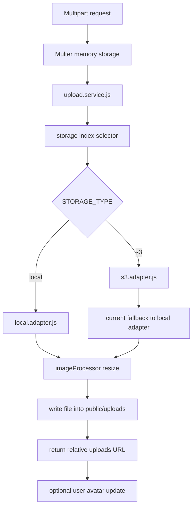

# Storage Flow

## Overview

Trainly supports image uploads for:

- user avatars
- post images

Key files:

- `backend/src/middleware/upload.js`
- `backend/src/services/upload.service.js`
- `backend/src/infrastructure/storage/index.js`
- `backend/src/infrastructure/storage/local.adapter.js`
- `backend/src/infrastructure/storage/s3.adapter.js`
- `backend/src/infrastructure/storage/imageProcessor.js`

## Upload Entry Points

Routes:

- `POST /api/uploads/avatar`
- `POST /api/uploads/post`
- `POST /api/users/avatar`

All active routes use Multer memory storage.

## Current Adapter Resolution

`backend/src/infrastructure/storage/index.js` selects the adapter using:

- `STORAGE_TYPE=local`
- `STORAGE_TYPE=s3`

Current practical behavior:

- `local` uses the local adapter
- `s3` currently logs a warning and falls back to the local adapter

So S3 is a placeholder, not a real remote storage implementation today.

## Local Storage Flow

The local adapter:

1. ensures the subdirectory exists under `backend/public/uploads`
2. generates a UUID-based filename
3. optionally resizes the image
4. writes the image to disk
5. returns a relative `/uploads/...` URL

Directories used:

- `public/uploads/avatars`
- `public/uploads/posts`

## Avatar Handling

`upload.service.uploadAvatar(...)`:

- verifies the file exists
- verifies the user exists
- uploads via the storage adapter
- updates the user's `avatar` field
- deletes the previous avatar if it was a local avatar path

## Post Image Handling

`upload.service.uploadPostImage(...)`:

- verifies the file exists
- uploads via the storage adapter
- returns the URL

It does not currently attach the image to a post automatically; clients use the returned URL when creating or updating post content.

## Upload / Storage Diagram

## Operational Notes

- uploaded assets are publicly served from `/uploads`
- file size limit is `10 MB`
- only image MIME types are accepted
- upload success/failure counters are exposed through `/metrics`
- `/api/health` reports the configured storage type and current active mode
