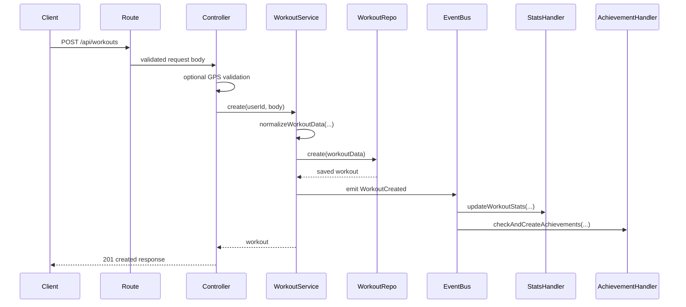

# Workout Flow

## Overview

Workout creation is the most important domain flow in the backend.

Key files:

- `backend/src/api/routes/workout.routes.js`
- `backend/src/api/controllers/workout.controller.js`
- `backend/src/services/workout.service.js`
- `backend/src/repositories/workouts/workout.repository.js`
- `backend/src/events/handlers/workoutHandlers.js`

## Create Workout

Route:

- `POST /api/workouts`

Flow:

1. `authMiddleware` authenticates the user
2. `validateRequest` validates the body against `createWorkoutSchema`
3. controller checks GPS route point validity if running route data is present
4. `workout.service.create(...)` normalizes the payload
5. repository persists the workout
6. service loads the user document and emits `WorkoutCreated`
7. event handlers update stats and achievements

## Normalization

`normalizeWorkoutData(...)` in `workout.service.js` currently:

- coerces `duration` and `calories` to numbers
- infers `startTime` if only `endTime` and `duration` exist
- generates a fallback `sessionId` if missing
- maps top-level `distance` into `running`, `cycling`, or `swimming`

## Read Workouts

Route:

- `GET /api/workouts`

Supported filters:

- `page`
- `limit`
- `type`
- `startDate`
- `endDate`
- `sortBy`
- `sortOrder`

Public feed:

- `GET /api/workouts/public/feed`

This returns workouts with `privacy: 'public'`.

## Stats

Route:

- `GET /api/workouts/stats/summary`

Current implementation:

- aggregates total workouts
- sums duration
- sums running/cycling/swimming distances
- sums calories

The `period` query parameter is accepted, but the repository currently does not apply period-based filtering in `getStats(...)`.

## Social Actions

Routes:

- `POST /api/workouts/:id/like`
- `POST /api/workouts/:id/comments`

Behavior:

- likes are toggled in-place on the workout document
- comments are appended directly to the embedded `comments` array

## Event Side Effects

When `WorkoutCreated` is emitted:

1. user stats update
2. achievement checks run
3. a feed notification stub logs in non-test environments

## Workout Creation and Stats Update Diagram

## Known Constraints

- workout stats period filtering is not fully implemented
- feed/analytics support services exist but the active public feed route uses repository reads directly
